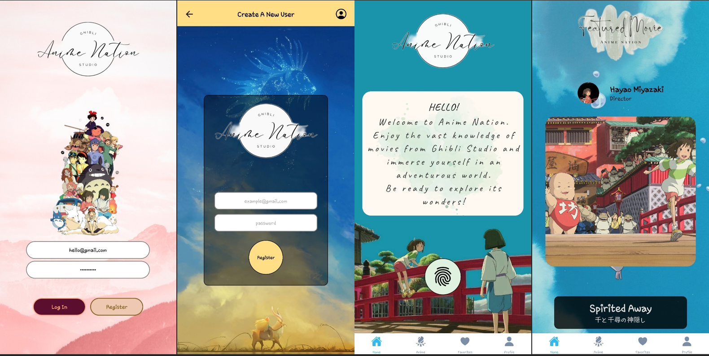
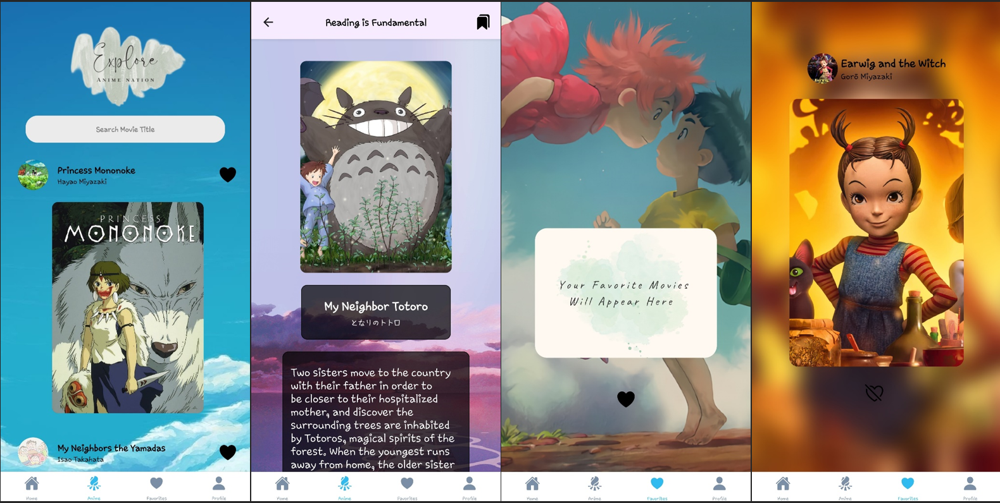
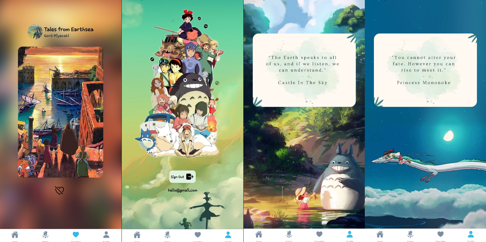

<h1 align="center">Welcome to Anime Nation!</h1>

The application offers vast knowledge of movies created by **_[Studio Ghibli](https://ghibliapi.herokuapp.com/)_**,
a Japanese animation film studio. It offers users to explore its wonders and immerse themselves
into its worldwide known animated movies like 'Spirited Away' and 'Howl's Moving Castle', to name a few.

Users will be able to create an account where they can search, save and read information about the
movies. This will serve as a tool of learning for them to have an overview about the movie before they decide to watch it.
It also includes some unknown features that users can enjoy once they find out where it is hidden.

  

  

  

### Created with:
- *Expo*
- *React Native*
- *SQLite*
- *Firebase*
- *Studio Ghibli API*

  
### Try it out: [Anime Nation](https://expo.dev/@giofra/animenation?serviceType=classic&distribution=expo-go)

## Thank you and hope you enjoyed the app!
